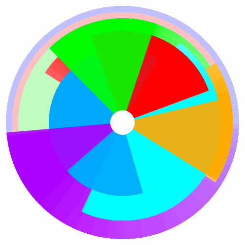

# Good-Readme-Generator

## Generate good README.md files automatically with this simple node.js app!

## Table of Contents

* [Installation](#installation)
* [Usage](#usage)
* [Credits](#credits)
* [License](#license)

## Installation

Download the repo, and run the app from terminal: node index.js.  

## Usage 

See the example video:  

## Credits

sole author  

## License

MIT  

## Badge

## Tests

Watchers

---

###### this good readme was created by readme-generator :)